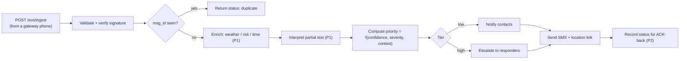

# Backend PRD — Offline Mesh SOS Relay (Cloud Service)
### Ingest · dedup · enrich · escalate · notify

**Owner:** Backend Lead (`<add teammate name>`)
**Team:** IIC 3.0 · Open Innovation
**Status:** Draft v1.0 · Hackathon build
**Companion docs:** `01_Frontend_PRD.md`, `03_API_Contract.md`

---

## 1. Purpose & Scope

The backend is the **cloud egress and intelligence layer**. It exists only where connectivity exists, and it does everything the offline phone deliberately cannot: receive forwarded SOS packets, deduplicate across gateways, enrich with live context, decide escalation priority, and notify contacts/responders.

**Senior call (the architectural spine):** *all live-data, weather, and AI logic lives here — never on the victim's offline phone.* This resolves the project's core contradiction: if the phone could call an API, it wouldn't need the mesh. The phone stays dumb; the cloud is smart. State this explicitly to judges.

**In scope (MVP):** ingest endpoint, cross-gateway dedup, responder/contact notification via SMS, health/keepalive. **P1:** live-context enrichment, AI interpretation of partial text, tiered escalation. **P2:** ACK issue-back, responder acknowledgement, persistence/analytics.

**Out of scope:** account systems, official-dispatch integration, long-term storage beyond demo needs.

---

## 2. Responsibilities

| ID | Requirement | Priority |
|---|---|---|
| BKD-1 | Ingest forwarded packets; **dedup on `msg_id`** across multiple gateways | P0 |
| BKD-2 | Notify emergency contacts/responders with a **location link** via cloud SMS | P0 |
| BKD-3 | **Live-context enrichment** — fetch weather/disaster/area risk for the coords to refine severity | P1 |
| BKD-4 | **AI interpretation of partial text** ("cnt breathe" → respiratory) for triage | P1 |
| BKD-5 | **Tiered escalation** — low → contacts; high → responders. Logic may only raise urgency, never cancel | P1 |
| BKD-6 | Issue delivery status / ACK for propagation back through the mesh | P2 |
| BKD-7 | Rate-limit + validate signatures (anti-spoof / anti-flood) | P1 |

---

## 3. Fail-Safe Principle (non-negotiable)

Ambiguity resolves **toward sending/escalating**. A false positive is a wasted "check on them" message; a false negative is a death — an asymmetric cost. Enrichment and AI **only ever raise priority or add context**; no code path suppresses an alert. This is both the ethical stance and the answer to the judge question *"what if your AI is wrong?"*

---

## 4. Processing Pipeline

---

## 5. Data & Storage

- **Dedup store:** `msg_id` → first-seen record (in-memory + lightweight persistence; the same SOS may arrive via several gateways).
- **SOS record:** the packet + gateway metadata + computed priority + notification status.
- **No PII beyond what the packet carries;** payload may arrive encrypted (backend handles routing metadata only, if E2E is enabled — P2).

---

## 6. Tech Stack

| Concern | Choice | Rationale |
|---|---|---|
| Runtime | Node (Cloud Function / small service) | Fast to deploy; matches a webhook-style ingest |
| Notification | Cloud SMS API — **MSG91 / Fast2SMS** (India) or **Twilio** (fastest to wire) | SMS reaches non-smartphone responders; Twilio quickest for the demo |
| Live context | Weather/disaster data source (P1) | Drives severity escalation |
| AI triage | Small text classifier / LLM call for fragment interpretation (P1) | Kept as an *enhancement*, not the headline — protects against AI-overreliance score cap |
| Dedup store | In-memory + minimal persistence | Cross-gateway dedup |

---

## 7. Non-Functional

- **No cold-start mid-demo:** free tiers sleep — expose a keepalive and warm it before presenting. *(This exact issue bit the last build; pre-warm it.)*
- **Idempotency:** duplicate `msg_id` POSTs are safe and return `duplicate`, never a second alert.
- **Security:** verify packet `sig`; per-origin rate-limit; reject malformed/expired packets with the correct error envelope (`03_API_Contract` §4).
- **CORS/headers:** accept `X-Gateway-Id`; correct content-types on every response.

---

## 8. Acceptance Criteria (MVP)

- A single `POST /sos/ingest` with a valid packet triggers exactly one real SMS to a responder number, with a working location link.
- The same `msg_id` posted twice (simulating two gateways) sends **one** alert and returns `duplicate` on the second.
- Health endpoint reports notifier connectivity; keepalive prevents cold-start.
- Malformed / bad-signature / oversized packets return the documented codes and status.

---

## 9. Parallel-Build Strategy

Ship a **mock ingest** first (accepts a packet, returns a canned `IngestResult`) so the client team builds forwarding + ACK against it immediately. A **packet generator script** lets the backend be developed and load-tested without the physical mesh. Enrichment (P1) slots in behind the same endpoint without changing the contract.

---

## 16. Roadmap (post-MVP)

ACK issue-back + responder acknowledgement · richer triage model · official-dispatch integration · persistence/analytics dashboard · E2E-encrypted payloads with triage-safe metadata · abuse/reputation scoring.

---

*IIC 3.0 · Open Innovation · v1.0 · pairs with `01_Frontend_PRD.md` + `03_API_Contract.md`*
