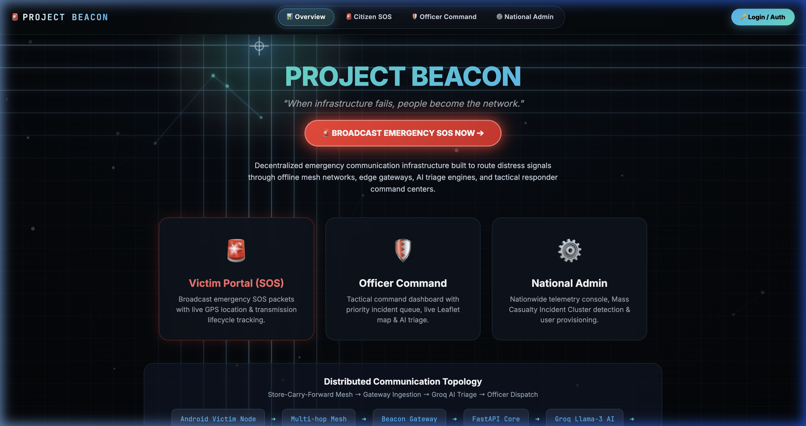
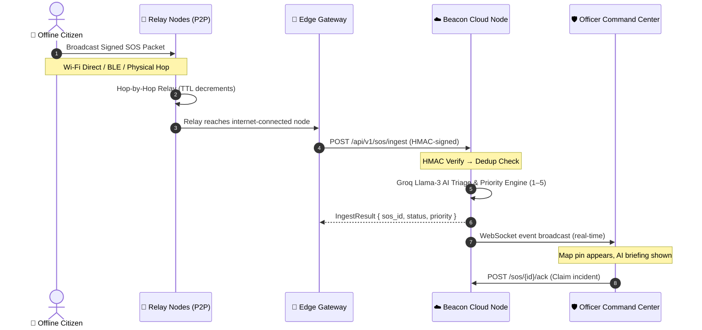
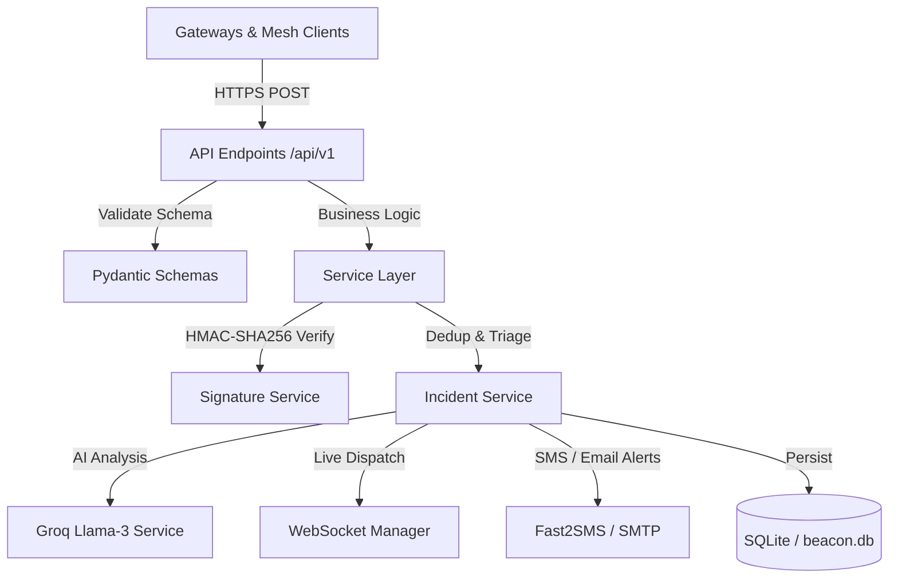

<p align="center">
  
</p>

<p align="center">
  
  
  
  
  
  
  
</p>

# Project Beacon 🚨

> One broadcast. Five hops. Every offline citizen becomes a relay node until the SOS reaches a responder.

**Project Beacon** is a decentralized, offline peer-to-peer (P2P) emergency communication relay network built for crisis environments where cellular infrastructure is down — natural disasters, grid outages, conflict zones. Distress signals hop phone-to-phone over Wi-Fi Direct and Bluetooth BLE until they reach an internet-connected edge gateway. There, the backend cryptographically verifies the packet, deduplicates it, runs Groq AI triage to assign a priority level, and broadcasts a real-time incident to every connected responder command center.

**Tags:** `Emergency Tech` · `Disaster Response` · `Mesh Networking` · `AI Triage` · `Bharat Academix CodeQuest 2026` · `FastAPI` · `Vanilla JS` · `SQLite` · `Groq AI`

---

## How it works (end-to-end)



A single citizen tap fans out into the mesh. Every intermediate relay decrements `ttl` and increments `hops`, guaranteeing the signal propagates without cycling. The **first gateway** to reach the cloud wins ingestion; all subsequent duplicates are suppressed before touching the AI pipeline.

---

## System architecture

Project Beacon is a two-part system split cleanly by ownership, sharing one contract. The backend is a strict three-layer design:



- **`API_CONTRACT.md`** is the single source of truth both sides build against. The backend's `schemas/packet.py` and the frontend's `fetch()` calls mirror it exactly.
- **The frontend never touches the database** — only the REST + WebSocket API.
- **The backend runs with zero external services** if only `SECRET_KEY` is set. Groq AI, SMS, and Email activate only when their env vars are present — no code changes needed.

See [`backend/README.md`](backend/README.md) for the service-layer architecture and the three core algorithms. See the [`API_CONTRACT.md`](API_CONTRACT.md) for the full packet schema and REST interface.

---

## Repository structure

```
SOS-Beacon/
├── API_CONTRACT.md              # SHARED contract — exact packet & REST schemas
├── README.md                    # You are here
├── LICENSE                      # MIT Open Source License
├── main.py                      # Root shim: loads .env, wires uvicorn to backend app
│
├── docs/                        # Project specs, PRDs, and diagrams
│   ├── banner.png               # README banner (landing page screenshot)
│   ├── COMPLETE_PRD.md          # Consolidated product requirements document
│   ├── FRONTEND_PRD.md          # UI requirements and user journey specs
│   ├── BACKEND_PRD.md           # API endpoints, DB schemas, and service specs
│   └── legacy/                  # Historical PRD drafts
│
├── backend/                     # Python FastAPI backend service
│   ├── main.py                  # CORS, static mounts, global error handlers
│   ├── requirements.txt         # Python dependency lock file
│   ├── .env.example             # Configuration template (copy → .env)
│   ├── README.md                # Backend architecture and setup docs
│   ├── app/
│   │   ├── api/v1/endpoints/    # Thin HTTP routing controllers
│   │   │   ├── gateway.py       # POST /sos/ingest — packet ingestion entry point
│   │   │   ├── victim.py        # Victim portal API
│   │   │   ├── officer.py       # Officer command API
│   │   │   ├── admin.py         # National admin telemetry API
│   │   │   ├── auth.py          # JWT login / session management
│   │   │   └── status.py        # Health check endpoints
│   │   ├── database/            # SQLAlchemy engine, session, and ORM models
│   │   ├── schemas/             # Pydantic schemas (validate against API_CONTRACT.md)
│   │   │   ├── packet.py        # SosPacket — the mesh packet schema
│   │   │   └── ingest.py        # IngestRequest / IngestResult wrappers
│   │   └── services/            # Standalone business logic
│   │       ├── signature.py     # HMAC-SHA256 signing & verification
│   │       ├── dedup.py         # In-memory packet deduplication filter
│   │       ├── groq_ai.py       # Groq Llama-3 AI triage engine
│   │       ├── incident_service.py  # Orchestration: dedup → AI → persist → notify
│   │       ├── auth.py          # JWT token generation and validation
│   │       ├── sms_notifier.py  # Fast2SMS + SMTP alert dispatcher
│   │       └── websocket_manager.py # Live telemetry broadcast to officers
│   └── tests/
│       └── mock_gateway_client.py  # End-to-end ingestion simulation script
│
└── frontend/                    # Vanilla HTML5/CSS3/JS web portals
    ├── index.html               # Entrypoint — redirects to landing
    ├── landing.html             # System overview and persona selection
    ├── victim.html              # Citizen distress broadcast simulator
    ├── officer.html             # Responder tactical dispatch + Leaflet map
    ├── admin.html               # National telemetric console & cluster monitor
    ├── css/
    │   ├── index.css            # Core design system and glassmorphism tokens
    │   └── polish.css           # Micro-animation and interaction polish
    └── js/
        ├── victim.js            # SOS packet signing, countdown, transmission flow
        ├── officer.js           # WebSocket feed, Leaflet map pin management
        └── mesh-bg.js           # Canvas animated mesh particle background
```

---

## Technology stack

| Layer | Technologies | Role |
| :--- | :--- | :--- |
| **Frontend** | HTML5, CSS3, Vanilla ES6 JavaScript | Glassmorphic UI, Canvas particle mesh animation |
| **Backend** | Python 3.12, FastAPI, Uvicorn | Async routing, CORS, custom error handlers |
| **Database** | SQLite, SQLAlchemy ORM | Zero-config local persistence (`beacon.db`) |
| **AI / NLP** | Groq Llama-3-70b API | SOS text analysis, priority scoring (1–5), tag extraction |
| **Security** | HMAC-SHA256, Python-Jose JWT | Packet integrity + officer session authentication |
| **Real-time** | Starlette WebSockets | Live incident feed from Cloud Node to officer map |
| **Notification** | Fast2SMS, SMTP | Optional SMS/email alerts to registered responders |

---

## Quickstart

### 1. Clone and create your virtual environment

```bash
git clone https://github.com/beastspirit2005/SOS-Beacon.git
cd SOS-Beacon
python -m venv .venv
source .venv/bin/activate   # Windows: .venv\Scripts\activate
```

### 2. Install dependencies

```bash
pip install -r backend/requirements.txt
```

### 3. Configure environment

```bash
cp backend/.env.example backend/.env
# Edit backend/.env and set at minimum:
#   SECRET_KEY=<any-long-random-string>
# Optionally add GROQ_API_KEY, FAST2SMS_KEY, SMTP_* for full features.
```

### 4. Start the server

```bash
.venv/bin/uvicorn main:app --reload --port 8000
```

| URL | What opens |
| :--- | :--- |
| `http://localhost:8000/` | System overview + persona selection |
| `http://localhost:8000/victim` | Citizen SOS broadcast console |
| `http://localhost:8000/officer` | Responder tactical command center |
| `http://localhost:8000/admin` | National telemetry dashboard |
| `http://localhost:8000/docs` | Interactive Swagger API docs |

---

## Testing the ingestion pipeline

With the dev server running, open a second terminal and run:

```bash
source .venv/bin/activate
python backend/tests/mock_gateway_client.py
```

The script simulates four scenarios and prints the server response for each:

| Test | Expected HTTP | Expected `status` |
| :--- | :--- | :--- |
| Valid SOS packet (HMAC-signed) | `200` | `accepted` |
| Duplicate of same `msg_id` | `200` | `duplicate` |
| Missing `X-Gateway-Id` header | `200` | `accepted` (header optional) |
| Tampered / bad HMAC signature | `401` | `BAD_SIGNATURE` |

---

## Security model

Every SOS packet is signed at origination using **HMAC-SHA256** over the canonical string:

```
HMAC-SHA256(SECRET_KEY, msg_id + ":" + origin_id + ":" + created_at + ":" + payload)
```

The Cloud Node rejects packets whose signature does not match, packets timestamped more than **24 hours** in the past, and packets dated more than **5 minutes** in the future. This prevents replay attacks and remote injection.

> **Dev bypass:** Packets with a signature starting with `ECDSA_HMAC_SHA256_` or equal to `UNSIGNED` skip cryptographic verification. This allows the frontend demo to send packets without implementing client-side HMAC.

---

## Scope and dev-vs-prod tradeoffs

| Concern | Demo / Dev | Production path |
| :--- | :--- | :--- |
| Database | SQLite (`beacon.db`) | Set `DATABASE_URL` to a PostgreSQL/PostGIS connection string |
| Mesh transport | Simulated via `victim.html` hop counter | Native Android BLE/Wi-Fi Direct library |
| AI triage | Live Groq API (requires `GROQ_API_KEY`) | Falls back to rule-based priority if key absent |
| Notifications | Optional Fast2SMS + SMTP | Set `FAST2SMS_KEY` and `SMTP_*` env vars |
| Signature bypass | `ECDSA_HMAC_SHA256_*` prefix allowed | Remove bypass block in `signature.py` |

---

## Contributing

Pull requests are welcome. Please read `API_CONTRACT.md` before adding or renaming any field — one renamed field silently breaks the entire delivery chain.

---

<p align="center">
  Built for <strong>Bharat Academix CodeQuest 2026</strong> · MIT License
</p>
