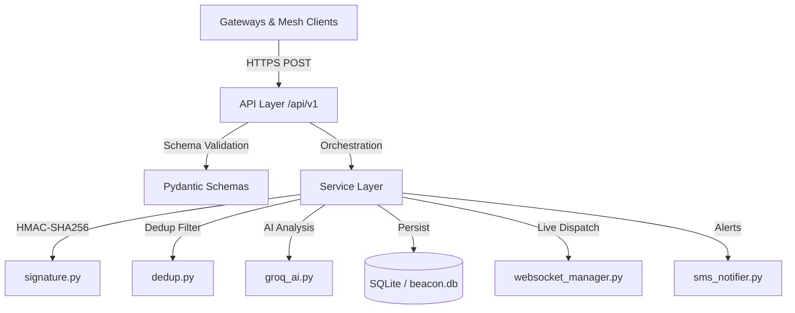

# Project Beacon — Backend Service 🚨

The Project Beacon backend is a professional, three-layered **FastAPI Cloud Ingestion & Orchestration Node** for an offline peer-to-peer mesh SOS network. It handles distress packet ingestion, cryptographic HMAC integrity verification, in-memory deduplication, Groq Llama-3 AI triage scoring, SQLite persistence, real-time WebSocket dispatch to officer command centers, and optional SMS/email alerts.

See [`../API_CONTRACT.md`](../API_CONTRACT.md) for the exact wire format both this service and the frontend build against.

---

## Architecture

The service is split into three clean, independently testable layers:



### Directory layout

```
backend/
├── main.py                  # CORS, static file mounts, global error handlers, env bootstrap
├── requirements.txt         # Python dependency lock file
├── .env.example             # Configuration template — copy to .env
├── README.md                # This file
├── app/
│   ├── api/v1/
│   │   ├── router.py        # Assembles all endpoint routers under /api/v1
│   │   └── endpoints/
│   │       ├── gateway.py   # POST /sos/ingest — main ingestion entry point
│   │       ├── victim.py    # Victim portal endpoints
│   │       ├── officer.py   # Officer command endpoints
│   │       ├── admin.py     # National admin telemetry
│   │       ├── auth.py      # JWT login / session management
│   │       ├── health.py    # Health check
│   │       └── status.py    # System status
│   ├── database/
│   │   ├── connection.py    # SQLAlchemy engine + session factory
│   │   └── models.py        # ORM table definitions
│   ├── schemas/
│   │   ├── packet.py        # SosPacket Pydantic model (matches API_CONTRACT.md)
│   │   └── ingest.py        # IngestRequest / IngestResult wrappers
│   └── services/
│       ├── incident_service.py  # Orchestration: dedup → AI → persist → notify → broadcast
│       ├── signature.py         # HMAC-SHA256 signing & clock-skew / replay protection
│       ├── dedup.py             # In-memory bloom-filter-style deduplication
│       ├── groq_ai.py           # Groq Llama-3 NLP triage & priority extraction
│       ├── auth.py              # JWT token creation and validation
│       ├── sms_notifier.py      # Fast2SMS + SMTP alert dispatcher
│       └── websocket_manager.py # Officer command center live telemetry
└── tests/
    └── mock_gateway_client.py   # End-to-end ingestion simulation (4 test scenarios)
```

---

## Quickstart

### 1. Environment setup

```bash
# From repository root:
cp backend/.env.example backend/.env
```

Edit `backend/.env`. At minimum, set:

```dotenv
SECRET_KEY=<any-long-random-string>
```

Optional keys that activate additional features:

| Variable | Feature |
| :--- | :--- |
| `GROQ_API_KEY` | Live Groq Llama-3 AI triage (falls back to rule-based if absent) |
| `FAST2SMS_KEY` | SMS alerts to registered responders |
| `SMTP_HOST`, `SMTP_USER`, `SMTP_PASS` | Email notifications |
| `DATABASE_URL` | PostgreSQL/PostGIS connection (default: SQLite `beacon.db`) |

### 2. Install dependencies

```bash
# From repository root:
python -m venv .venv
source .venv/bin/activate       # Windows: .venv\Scripts\activate
pip install -r backend/requirements.txt
```

### 3. Run the dev server

```bash
# From repository root (loads backend/.env automatically):
.venv/bin/uvicorn main:app --reload --port 8000
```

- **Swagger UI**: `http://localhost:8000/docs`
- **Web App**: `http://localhost:8000/`

---

## Core algorithms

### 🔒 Cryptographic integrity (`services/signature.py`)

Every SOS packet is signed at origination using **HMAC-SHA256** over a deterministic canonical string:

```
HMAC-SHA256(SECRET_KEY, msg_id:origin_id:created_at:payload)
```

The Cloud Node rejects packets that:
- Have a signature that does not match
- Were created more than **24 hours** ago (replay protection)
- Are timestamped more than **5 minutes** in the future (clock-skew tolerance)

**Dev bypass:** Signatures starting with `ECDSA_HMAC_SHA256_` or equal to `UNSIGNED` pass without cryptographic verification. This lets the web frontend demo work without implementing client-side HMAC.

### 🧠 AI triage engine (`services/groq_ai.py`)

Every accepted (non-duplicate) packet is analyzed by **Groq Llama-3-70b-8192**. The model extracts:

| Field | Type | Description |
| :--- | :--- | :--- |
| `priority` | `int 1–5` | Severity level (5 = critical, life-threatening) |
| `category` | `string` | Medical / Fire / Search & Rescue / Infrastructure / Other |
| `trapped_count` | `int` | Estimated number of trapped persons |
| `tags` | `string[]` | Fast-indexing labels (e.g. `["flood", "children", "medical"]`) |
| `triage_summary` | `string` | One-line dispatcher briefing |

### ♻️ Deduplication filter (`services/dedup.py`)

The dedup filter maintains an in-memory set of `msg_id` values seen in the current server session. Any packet with a previously seen `msg_id` is returned as `status: duplicate` without touching the AI pipeline or the database. The filter is initialized from the database on startup so duplicates are also caught across server restarts.

---

## API endpoints (summary)

Full schemas and response shapes are in [`../API_CONTRACT.md`](../API_CONTRACT.md).

| Method | Path | Auth | Description |
| :--- | :--- | :--- | :--- |
| `POST` | `/api/v1/sos/ingest` | `X-Gateway-Id` header | Main SOS packet ingestion |
| `GET` | `/api/v1/sos/list` | JWT Officer | List all incidents |
| `POST` | `/api/v1/sos/{id}/ack` | JWT Officer | Claim an incident |
| `POST` | `/api/v1/auth/login` | — | Officer/Admin login |
| `GET` | `/api/v1/status` | — | System health and uptime |
| `WS` | `/ws/officer` | JWT | Live incident feed |

---

## Testing

With the dev server running on port 8000:

```bash
# Run the end-to-end simulation client:
python backend/tests/mock_gateway_client.py
```

Expected output:

```
Response 1 Status: 200  →  { "status": "accepted", "priority": "high" }
Response 2 Status: 200  →  { "status": "duplicate" }
Response 3 Status: 200  →  { "status": "accepted" }   (missing gateway ID is allowed)
Response 4 Status: 401  →  { "code": "BAD_SIGNATURE" }
```
